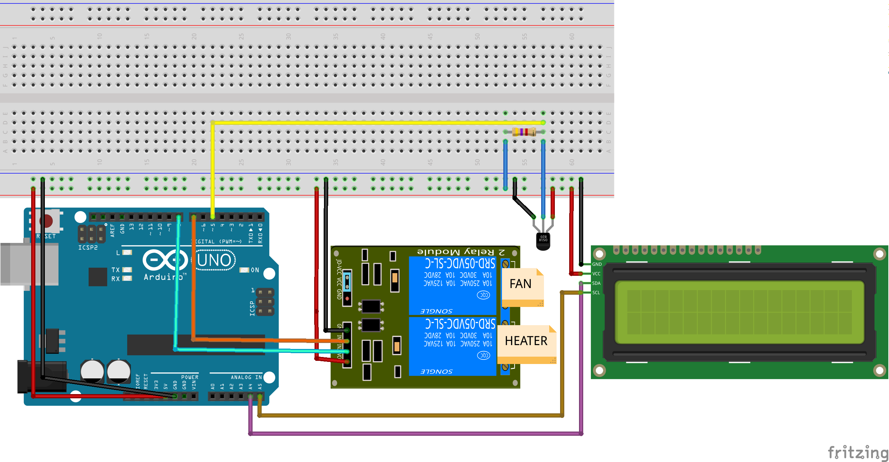

# Aquarium temperature controller

This repository holds the code for an aquarium temperature controller that runs on an Arduino based board. It helps me to have some peace of mind regarding the temperature in my aquarium.

The idea is pretty simple: When the temperature is above a defined threshold, turn on a few fans to cool the water on the aquarium and when the temperature is bellow a define threshold, turn on an aquarium heater to raise the temperature of the water.

I also included an LCD screen to show the current temperature and the status of the heater and fans. (ON or OFF)

## What is the required hardware to run this?

- [An arduino based board](https://www.arduino.cc/en/Main/Boards)
- 1x [DS18B20 thermometer](https://datasheets.maximintegrated.com/en/ds/DS18B20.pdf)
- 1x [2 channel 5V Relay module with optocoupler](http://www.handsontec.com/dataspecs/2Ch-relay.pdf)
- 1x 4.7k ohm resistor for the DS18B20 thermometer
- 1x [16x2 LCD I2C module](https://www.instructables.com/LCD-With-I2C/)

## How do hook this up?

It's all pretty straight forward and configurable through a few constants in the code. You can use the following diagram as a guide:

### ATTENTION!

Be very careful when handling alternating current, it can cause severe [electrical injury](https://en.wikipedia.org/wiki/Electrical_injury)! Only handle with the fans and heater cables when they're disconnected from the power line.